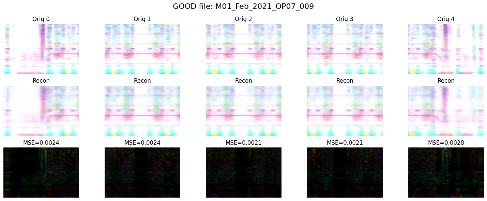
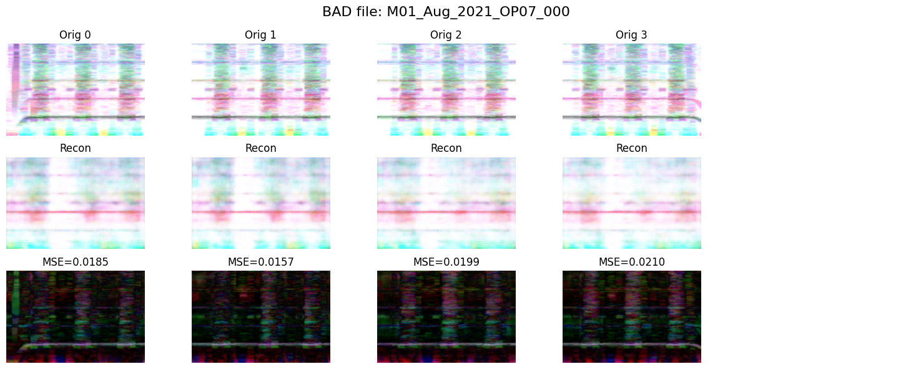

# Idea of processing Bosch-Dataset

- Time series of varying length are split into fixed-size segments
- Each segment is converted into a spectrogram
- an AE is trained only on normal (GOOD) sequences
- During inference, the model reconstructs all segments of a sequence
--> The total reconstruction error indicates anomalies

**Reconstruction Error**\
Mean: 0.00237 Max: 0.00277

---------------------------------------

**Reconstruction Error**\
Mean: 0.01878 Max: 0.02097